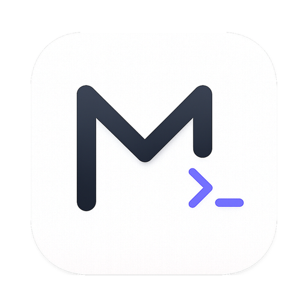
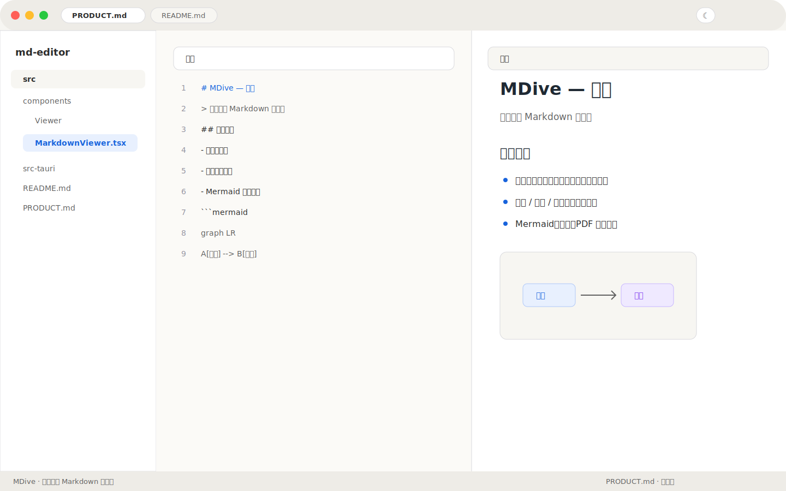
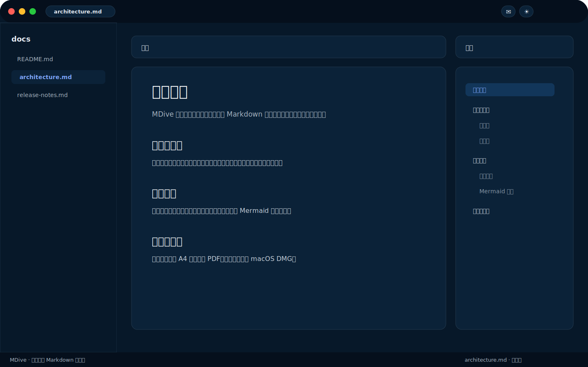
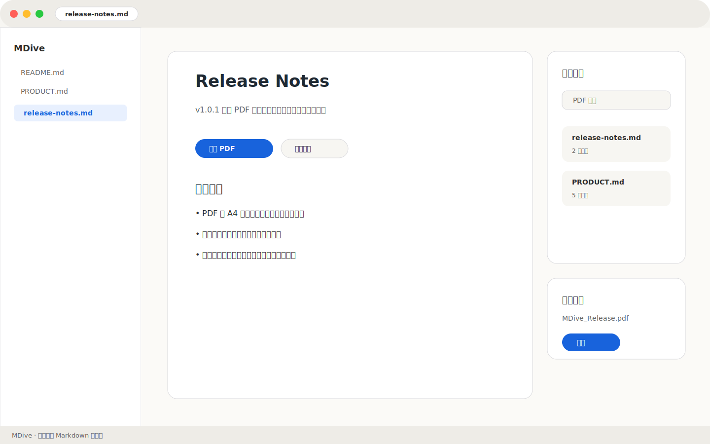

# MDive — 墨潜

<p align="center">
  
</p>

<p align="center">
  <strong>潜入你的 Markdown 工作区</strong>
</p>

<p align="center">
  
  
  
  
</p>

MDive（墨潜）是一个以**工作区文件夹**为核心的本地 Markdown 查看与编辑工具。
它面向开发者和技术写作者，适合配合 VS Code / Claude Code 作为实时预览器，也可以独立完成 Markdown 写作、预览、搜索和导出。

---

## 界面预览

> 以下为基于当前产品界面绘制的展示预览图。后续可替换为真实运行截图或演示 GIF。







## 核心亮点

- **工作区优先**：启动选择文件夹，左侧文件树递归展开，多标签页并排查看
- **三档视图**：源码 / 分栏 / 预览，覆盖写作、校对、阅读三种场景
- **实时预览**：CodeMirror 编辑器 + Markdown 渲染预览，支持左右同步滚动
- **文档导航**：预览模式内置大纲，长文阅读时可快速跳转章节
- **多格式查看**：支持 `.md` / `.mdx` / `.markdown` / 图片 / PDF 内嵌预览
- **Mermaid 图表**：`mermaid` 代码块自动渲染为流程图，并随亮色 / 暗色主题切换
- **全文搜索**：`Cmd+Shift+F` 跨工作区搜索，结果按文件聚合，点击跳转
- **安全编辑**：关闭标签、切换文件、关闭窗口时拦截未保存内容
- **PDF 导出**：按 A4 分页导出正文内容，使用 JPEG 压缩控制文件体积
- **macOS 体验**：沉浸式标题栏、自定义 Dock 图标、原生菜单与文件关联

## 适用场景

- 在 VS Code 中写 Markdown，用 MDive 作为独立实时预览窗口
- 浏览技术文档、项目说明、学习笔记和长篇 Markdown
- 在本地工作区中搜索 Markdown / 文本内容
- 将 Markdown 预览正文导出为 PDF 文档

## 技术栈

| 层级 | 技术 |
|------|------|
| 桌面壳 | Tauri v2 (Rust) |
| 前端 | React 19 + TypeScript + Vite |
| 编辑器 | CodeMirror 6 |
| Markdown | marked.js + highlight.js |
| 图表 | Mermaid.js |
| 导出 | html2canvas + jsPDF |
| 样式 | CSS Variables + 自定义主题 |

## 本地开发

```bash
npm install
npm run tauri dev
```

## 本地打包

```bash
npm run tauri build
```

构建产物位于：

```text
src-tauri/target/release/bundle/
```

当前版本已在 macOS 上完成本地 DMG 打包验证。正式面向他人分发前，建议补充 Apple Developer 代码签名与 Notarization，避免 Gatekeeper 安全提示影响安装体验。

## 项目状态

- 当前版本：`v1.0.1`
- 当前平台：macOS
- 当前定位：个人作品展示 + 本地可安装应用
- 分发状态：源码已公开；Release 说明见 [RELEASE_NOTES.md](./RELEASE_NOTES.md)

## 后续计划

- 补充真实运行截图与演示 GIF
- 增加 Apple 代码签名与 Notarization
- 增加自动更新机制
- 增加 Windows / Linux 构建验证

## 产品文档

完整产品定位、功能清单、技术架构与变更记录见 [PRODUCT.md](./PRODUCT.md)。
